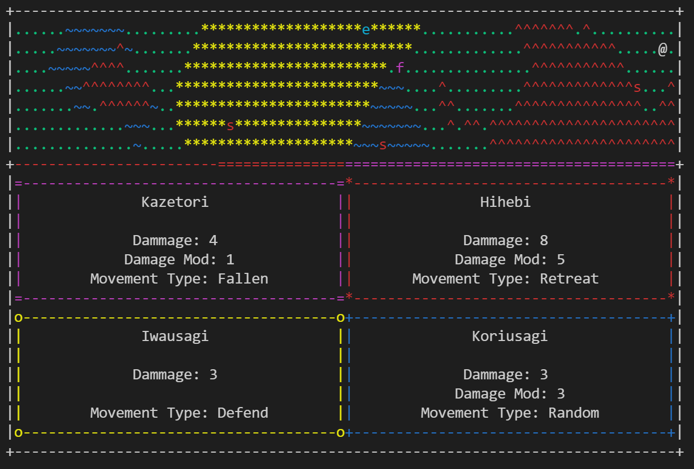

# Katana (arcade-ish roguelite)

### Overview
Katana is an arcade-ish roguelite with complex combat  and an interesting movement system. In it, you use four katanas to battle wave after wave of monsters, searching for that high score.

### Compile
Katana should compile on any system with [ncurses](https://invisible-island.net/ncurses/ncurses.html) and a gcc compiler. A sample of how this might be achieved is shown below.

```
$git clone https://github.com/dragonsploder/Rogue-Katana.git
$cd Rogue-Katana
$gcc Katana.c -lm -Wall -Wextra -Wpedantic -okatana -lncurses
$./katana
```

Note it is also possible to compile on Windows (tested with mingw) with [pdcurses](https://pdcurses.org/).


#### More info (like how to play) can be found in the manuel